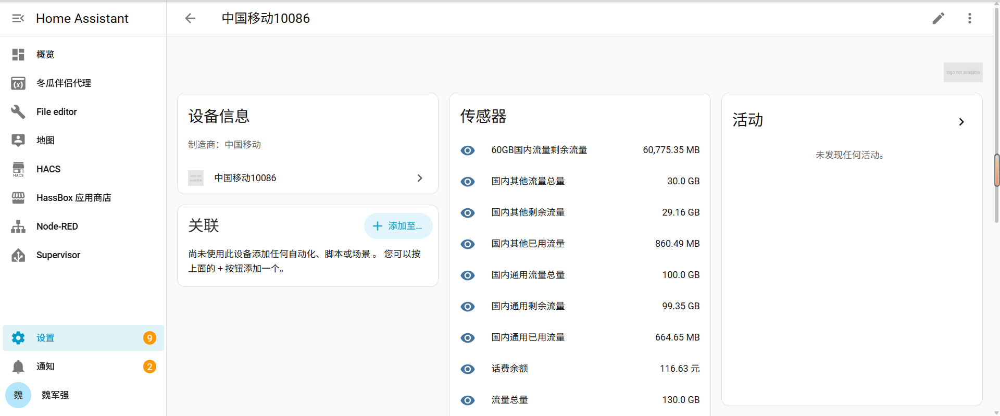

# 中国移动10086 Home Assistant 集成（实验版）

从自己的“中国移动10086”微信服务号读取话费、流量和通话余量，集成每 30 分钟尝试更新一次。所有网络请求都是只读的；不会充值、订购、退订或修改账号。

> **当前限制：** 微信服务号会话可能在下一次轮询前失效。实测旧请求中的 `d.sid` 失效后，三个查询接口均返回“升级公告”页面；重新抓取的新 `d.sid` 可恢复查询。当前集成没有自动续期方式，不能保证持续每 30 分钟更新。遇到传感器“不可用”且微信内仍可查询时，请重新抓取并在集成“配置”中导入新请求。缩短轮询间隔不能延长会话有效期。

## 在 Home Assistant 中的效果

下图是设备页面，可查看话费余额及各类流量的剩余量、已用量和总量。截图中的数值仅为展示时的账号状态。

## 下载与安装

从 [Releases](https://github.com/cumtwjq/china-mobile-10086-ha/releases/latest) 下载：

- `china_mobile_10086-experimental.zip`：Home Assistant 集成安装包。
- `china_mobile_10086-local-capture.zip`：Windows 本地抓取工具，包含 Python 和 mitmproxy，无需另外安装。

按[安装说明](INSTALL.md)安装。首次配置用[本地抓取工具](local_tool/本地抓取说明.md)获取自己账号的只读请求 JSON，并粘贴到 HA 配置页。仓库和下载包不包含个人抓包数据、Cookie 或 CSRF 凭证。

## 传感器

- 话费余额。
- 总流量、国内通用流量、国内其他流量的剩余量、已用量和总量。
- 剩余通话、已用通话、通话总量。
- 每个流量套餐的剩余量；总量、已用量和到期日放在传感器属性中。

单位按服务号页面脚本核对：流量接口的单位代码 `1` 为 MB，HA 中的 GB 以 1024 MB 换算。登录凭证失效后，在集成的“配置”中导入新的本地抓取请求。

登录请求没有可读取的固定有效期；失效后重新抓取。三个只读查询接口不会签发新的 `d.sid`，因此目前无法从已抓取的请求自动续期。`wx.10086.cn` 对部分 Python TLS 客户端只提供旧版 TLS 1.2 密码套件，本集成仅对该域名使用兼容配置，仍校验证书。

## 鸣谢

感谢 **Codex** 全程指导、编写代码并整理文档；感谢账号持有人提供实际数据并在 Home Assistant 中验证集成效果。
